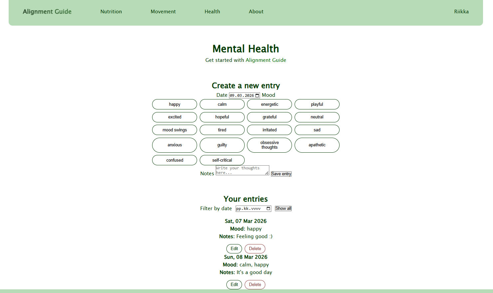
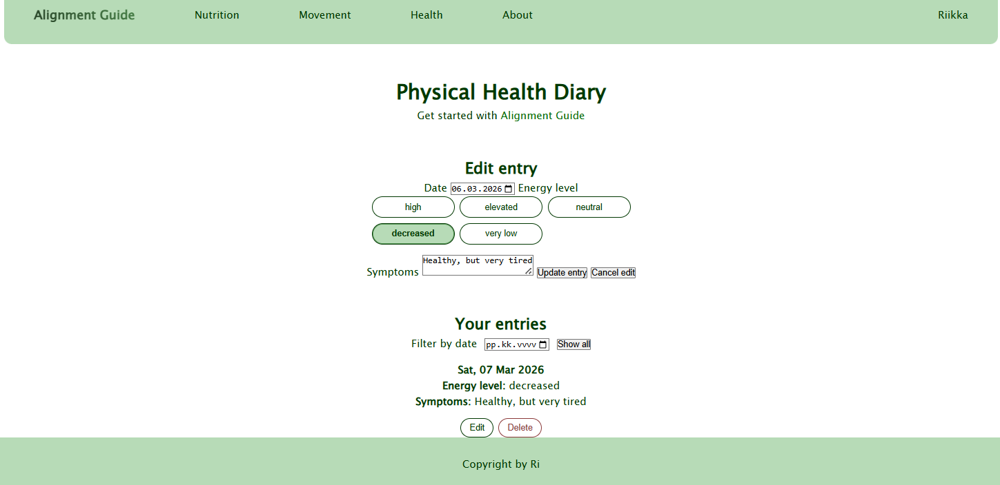
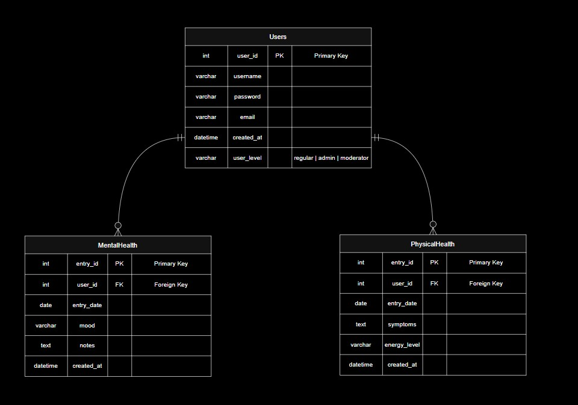

Kuvakaappaukset sovelluksen käyttöliittymästä
    
    

Tietokannan kuvaus
   (mood on vaihdettu varcharista textiksi, jotta käyttäjä voi valita useamman moodin)

Listaus ja kuvaus kaikista toiminnallisuuksista, mitä olet toteuttanut
    - Sovellukseen voi kirjautua sisään
        - Salasana tallennetaan hashattuna ja saltia käyttäen tietokantaan
        - Kirjautumisessa hyödynnetään tokenia
    - Kirjautunut käyttäjä voi tehdä mentalhealth- tai physicalhealt-päiväkirjamerkintöjä.
        - Käyttäjä voi
            - luoda uuden entryn (ei tulevaisuuteen)
            - poistaa entryn
            - muokata entryä
            - hakea entryä päivämäärän perusteella
            - hakea kaikki omat entryt

Mahdolliset tiedossa olevat bugit/ongelmat/puutteet
    - Frontendin validaatio jäänyt kesken. Esim. frontend ei ilmoita käyttäjälle, jos yritetään rekisteröityä samalla sähköpostiosoitteella uudestaan, eikä käyttäjää myöskään neuvota riittävästi rekisteröitymisessä tai kirjautumisessa. Esim. salasana liian lyhyt tai väärä salasana/sähköposti jne.
    - Uloskirjautuessa jos on mentalhealth/physicalhealth -sivulla, ne jäävät näkyviin vaikka niiden ei kuuluisi näkyä kirjautumattomalle käyttäjälle. Olisi pitänyt ohjata esim. etusivulle uloskirjautumisen jälkeen.
    - Frontendin tyylittely jäänyt täysin kesken, responsiivisuus puuttuu

Projektin koodi on luotu täysin chatGPT:n koodia ja opettajien esimerkkikoodia yhdistelemällä. Projektin tietokanta, sekä tiedostorakenne on suunniteltu itse, samoin toiminnallisuudet sekä ulkoasu. Koodi on ymmärretty ja kommentoitu omasta toimesta.