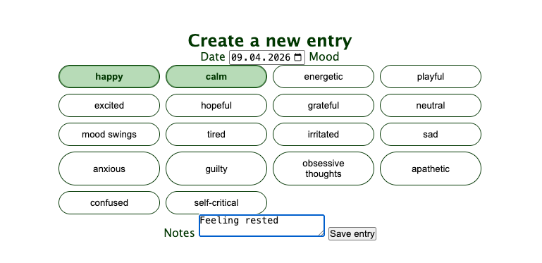

## Tehtävä 2
- Kirjautumistesti onnistunut 
- Tehtävän koodi on yhdistelty opettajan esimerkistä ja Chat GPT:n luomasta koodista

## Tehtävä 3
- Browser Library testit onnistuu
- Koodi on ChatGPT:n avulla luotu.

_Alkuperäinen tilanne_

_Testin jälkeen_

## Tehtävä 4

- Päiväkirjamerkinnän teko onnistuu
- Koodi on ChatGPT:n avulla luotu

_Testin aikana_

## Tehtävä 5

- Kirjautuminen käyttäen .env-tiedostoa onnistuu
- Koodi on ChatGPT:n avulla luotu

## Tehtävä 6

- Kirjautuminen käyttäen CryptoLibrarya onnistuu
- Koodi on ChatGPT:n avulla luotu

## Testitulokset

Testien ajon jälkeen raportit löytyvät täältä:
 
- [Outputs](outputs/)
    - [Viimeisin report](outputs/report.html)
    - [Viimeisin log](outputs/log.html)