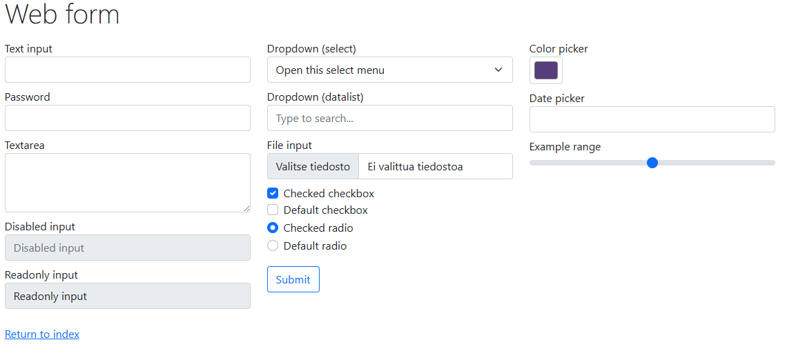
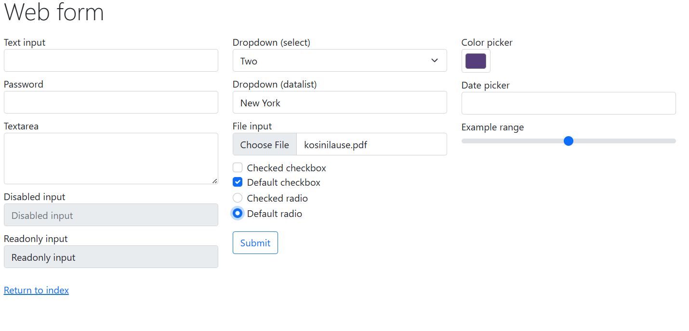

Tehtävä 2
- Kirjautumistesti onnistunut 
- Tehtävän koodi on yhdistelty opettajan esimerkistä ja Chat GPT:n luomasta koodista

Tehtävä 3
- Browser Library testit onnistuu
- Koodi on ChatGPT:n avulla luotu.

Alkuperäinen tilanne

Testin jälkeen. 